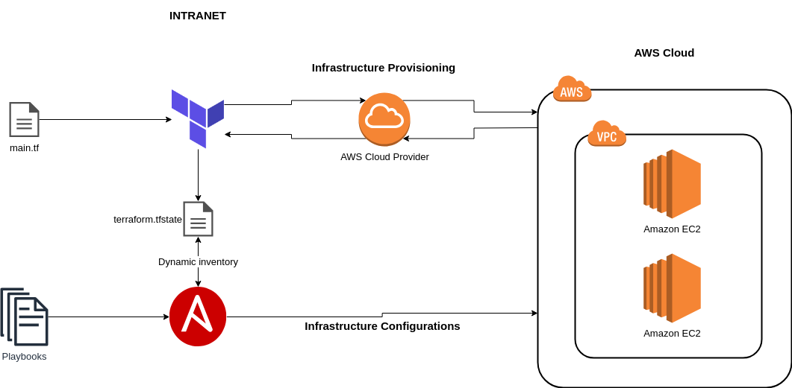
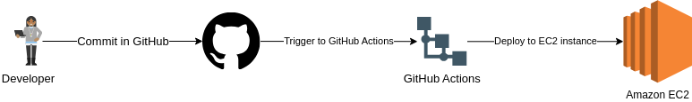
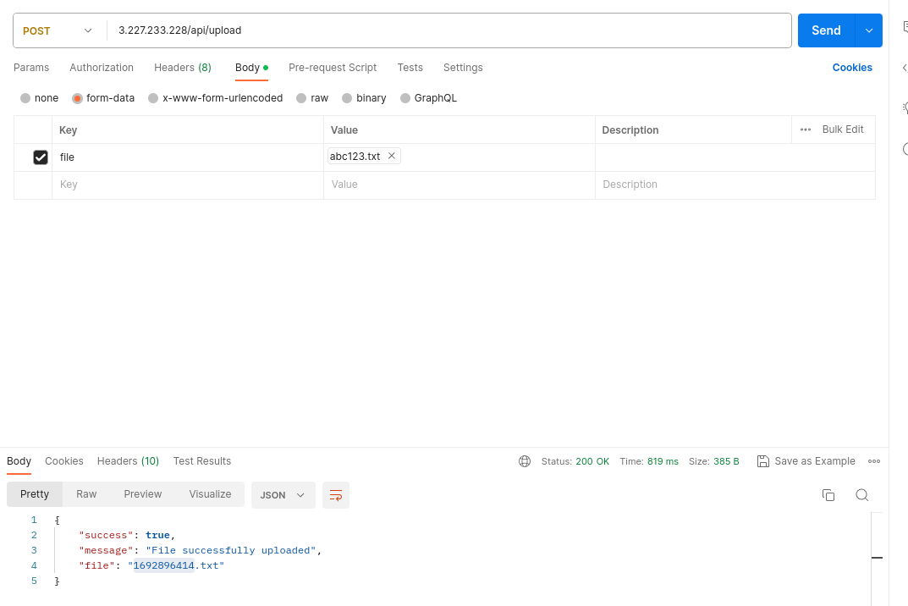
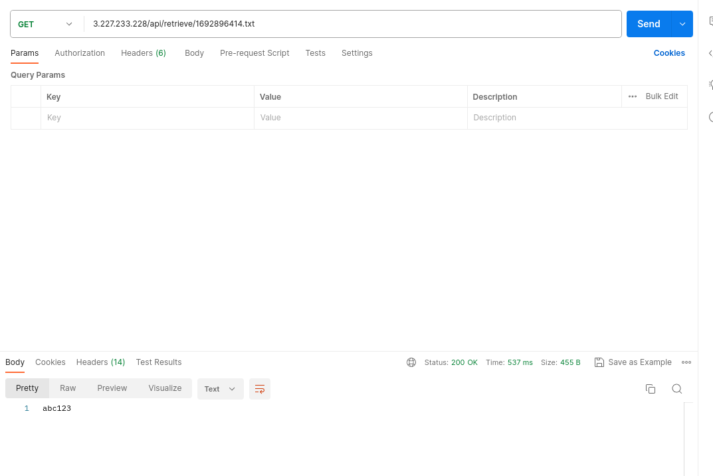
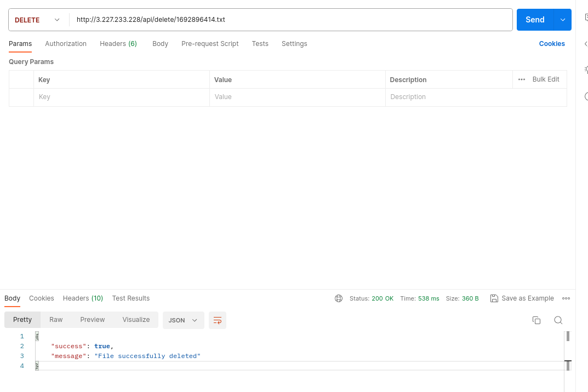

# Document #

## Introduction
+ A Laravel API web application

## Tech stack
+ Terraform: Provision AWS resources (EC2, Security group) & Execute Ansible Playbook
+ Ansible: Install Docker & Setup source code for the 1st time (git clone, setup Laravel configs, Composer install, fix files/folders permissions)
+ GitHub: code hosting platform, CICD pipeline
+ AWS: web application hosting platform
+ Docker: OS-level virtualization (PaaS)
	+ WebApp: Laravel, MySQL
		+ Laravel Routes:
			+ [POST](http://{EC2 PUBLIC IP}/api/upload)
			+ [GET - download](http://{EC2 PUBLIC IP}/api/retrieve/1692896180.txt)
			+ [GET - view file content](http://{EC2 PUBLIC IP}/files/1692896180.txt)
			+ [DELETE](http://{EC2 PUBLIC IP}/api/delete/1692896180.txt)

## Architecture



## Prerequisites
+ Install Terraform, Ansible on Local
+ AWS setup
	+ AWS accounts (root account & an IAM account)
	+ AWS EC2 Key pair

## Scenario(s)
+ Scenario 01: DevOps create a new environment
	+ **NOTE**
		+ Terraform will asks for GitHub account (username, password)
	+ Prerequisites
		+ Create a new GitHub repo for source code only, it will be used for CICD demo below
		+ Update Terraform with AWS keys (access key & secret access key, and EC2 key pair) & existed VPC, subnet (with Internet Gateway for Public IP)

```
terraform init
terraform plan
terraform apply

# After Terraform finishs, it will output AWS EC2 instance's Public IP
# Terraform & Ansible build time should take around 11-13 minutes
```

+ After "Scenario 01", you will have: Laravel APIs running on AWS EC2 instance within Docker containers
	+ Code is cloned to folder `/tmp/test01` on AWS EC2 instance
	+ AWS EC2 instance is using `t2.micro` & `ami-0dba2cb6798deb6d8`
	+ AWS EC2 instance's Security group rules:
		+ inbound port(s): 22, 80
		+ outbound port(s): 0

+ Scenario 02: CICD pipeline
	+ Prerequisites
		+ Add GitHub Action secrets
			+ `SSH_PRIVATE_KEY` [required] : could re-use "AWS EC2 Key pair", or use a separated key pair (I prefer the later)
			+ `REMOTE_HOST` [required] : eg: mydomain.com. In this case, it should be AWS EC2 instance's Public IP
			+ `REMOTE_USER` [required] : eg: myusername. In this case, is should be `ubuntu`
			+ `REMOTE_TARGET` (optional, default '/home/REMOTE_USER/') : The target directory, source code folder. In this case, it should be `/tmp/test01`
			+ For more details, please check [this repo](https://github.com/easingthemes/ssh-deploy)
		+ Add GitHub Action workflow (please, check section "Link(s)")
	+ Workflow
		+ A dev push code to branch "main", then GitHub Actions will be triggered to deploy to AWS EC2 instance
		+ Pipeline just simply clones code, runs Composer install, and then `rsync` to EC2 instance

## Link(s)
+ [GitHub Action workflow](https://github.com/kahntran-dev/Coin98-test/blob/main/laravel-code/.github/workflows/main.yml)
+ [Source code & IaC, CaC repo](https://github.com/kahntran-dev/Coin98-test)
+ [My repo with running CICD](https://github.com/kahntran/test01)

## Postman



